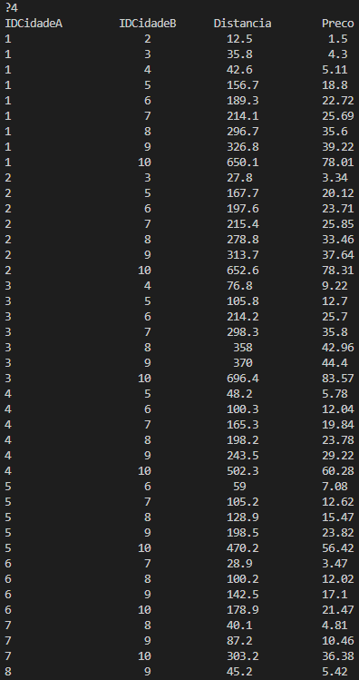

# highway-traffic-management
A Python program to facilitate the organization, structuring, querying, and processing of data related to highway traffic management

- [Practical Assignment](enunciado.pdf)
- [Project files](project)
- [Project Report](project/1012527-1012539_WG.pdf)

##### Menu

##### Dono (Owner)

 

##### Carros (Cars)

 

##### Cidades (Cities)

 

##### Distâncias (Distances)

 

##### Passagens (Traffic)

 

-----

Discover additional projects from this class in the [Algoritmos e Estruturas de Dados repository](https://github.com/danielmribeiro/ipg-lei-algoritmos-e-estruturas-de-dados).

For more course-related assignments, check out the [Engenharia Informatica repository](https://github.com/danielmribeiro/engenharia-informatica).
